

<h1>The Choban Algorithm</h1>

The Choban Algorithm is a website that was created for my first project assignment in the Code Institute course. Its purpose is to inspire people to live a more natural lifestyle. In the future, my dream is to further develop this site into a blog and possibly even a podcast. The primary goal of the Choban Algorithm is to provide inspiration for those seeking a natural way of life. \
View the live page [here](https://birgerosterberg.github.io/thechobanalgorithm/)

---

## Design

---

The Choban Algorithm website is designed as a one-page website with links to different parts of the page. This layout provides a smooth and seamless experience for users who can easily navigate through the different sections of the site. The navigation menu at the top of the page is sticky, meaning it stays in place as users scroll down the page, making it easy to access at all times. Each section of the page has its own unique content.

By presenting all this information on one page with links to different sections, users can easily find what they're looking for without having to navigate through multiple pages. The result is a user-friendly and visually appealing website that encourages visitors to explore and engage with the content.

### Fonts

|                  Ubuntu                  |                  Gloria Halleluja                  |                  Indie Flower                   |
| :--------------------------------------: | :------------------------------------------------: | :---------------------------------------------: |
| 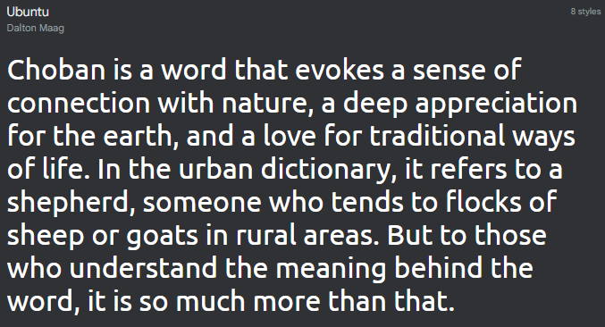 | 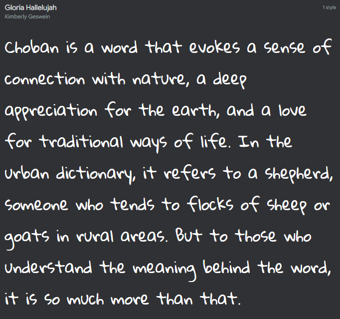 | 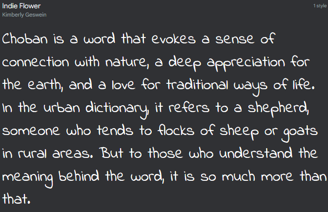 |

### Color scheme

### Wireframes / Mockups

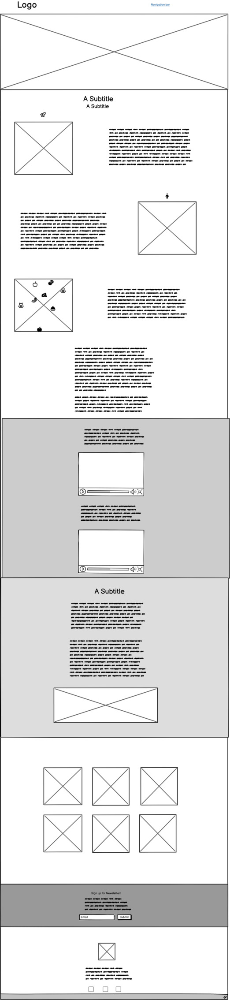

---

## Features

---

- **Navigation**

  - Its located at the top of the page and contains links to different sections of the website, including Home, About, Inspiration, Permaculture, Gallery, and Signup pages.
  - The menu is sticky, meaning it stays in place as users scroll down the page, making it easy to access at all times.
  - The links are also designed with hover effects and a pointer cursor to make it clear to users what they can click on. \
    

- **Hero**

  - This is the first thing that catches the user's eye and features a captivating image that piques their curiosity and draws them into the site. This section is designed to keep the user guessing about what the site is really about, opening up curiosity and encouraging them to explore further \
    

- **About**

  - Explaining the meaning of The Choban Algorithm
  - Provides an overview of the website's purpose and goals.
  - This section also includes information about me and their motivations for creating it. \
    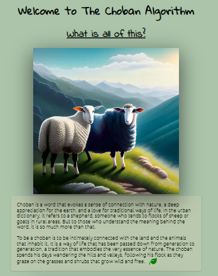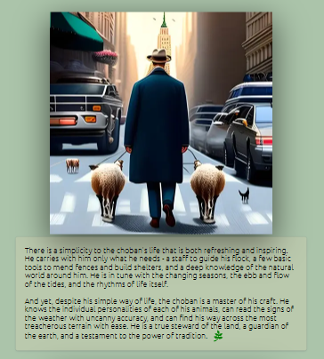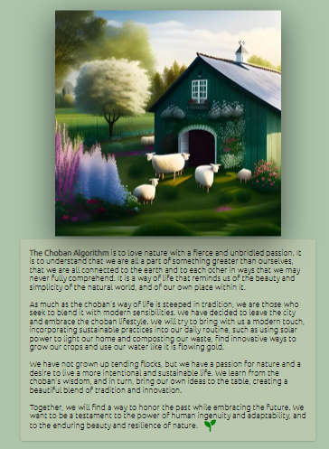 \
    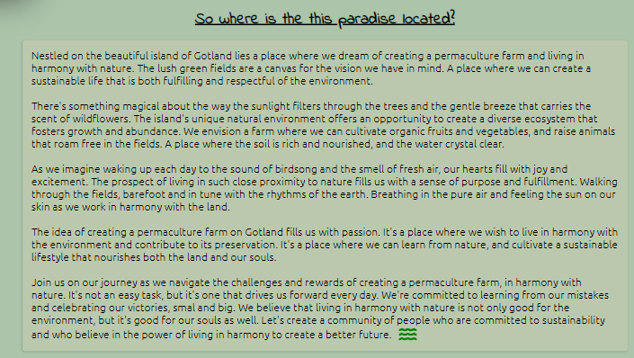

- **Inspiration**

  - Youtube video links, that offers ideas and inspiration for living a more natural life.
  - Will include tips and resources on topics such as sustainable living, eco-friendly products, and healthy eating.
  - The aim of this section is to provide users with practical ideas that they can incorporate into their daily lives. \
    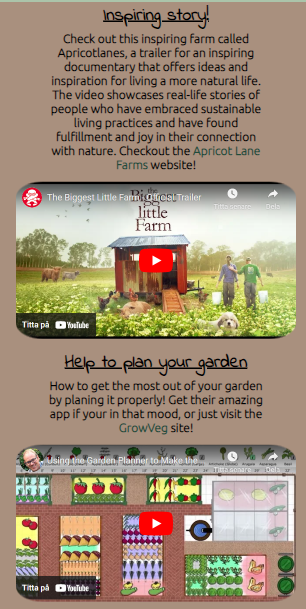

- **Permaculture**

  - Provides information on permaculture principles and practices.
  - This section explains what permaculture is and offers resources and guides for those interested in implementing permaculture principles in their own lives. \
    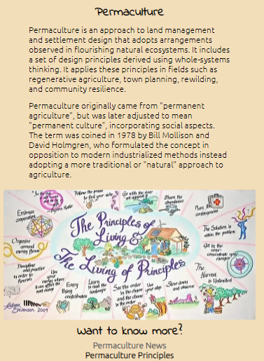

- **Gallery**

  - Showcases stunning images of nature and sustainable living.
  - Includes a collection of images that are designed to inspire users and encourage them to appreciate the beauty of nature. \
    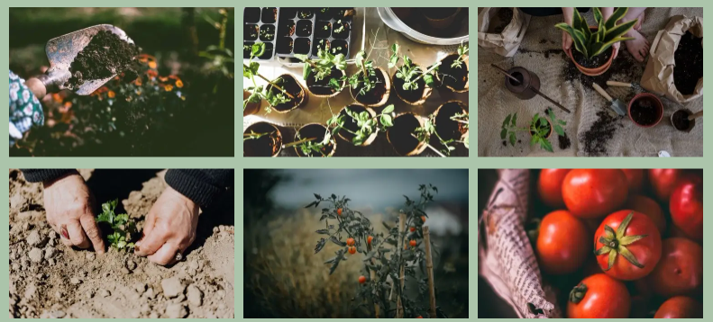

- **Signup**

  - Offers users the opportunity to sign up for a newsletter or updates on future blog posts or podcasts(In the future!).
  - Includes a simple form with only an email required that users can fill out to receive updates from the website.
  - The aim of this section is to encourage users to engage with the website and become part of the community. \
    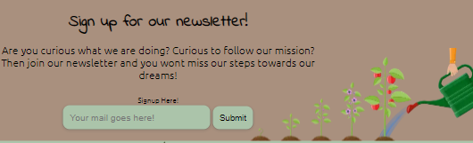

- **Footer**

  - Contains links to the different social media pages that will be available in the future, but for now, they go to the basic pages of Instagram, Facebook, and YouTube
  - There is a mailto link with a made-up email address that makes it easy to send an email. \
    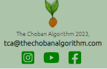

- **404.html**

  - Contains an error screen where users are taken if they try to reach something that does not exist on this site. There is also the navbar from above on this page to get back \
    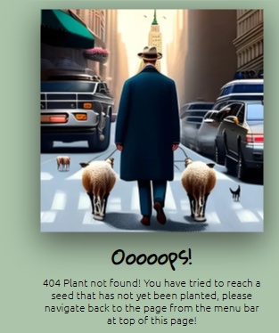

- **thanks.html**

  - Is the page the user is directed to when signed up to for the newsletter. There is also the navbar from above on this page to get back \
    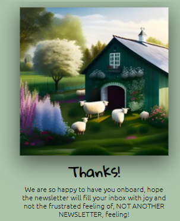

---

## Tools and Technologies Used

---

- HTML
  - The main structure of the site was developed using HTML.
- CSS
  - The website was styled using CSS with an external file.
- Visual Studio Code
  - The website was developed with Visual Studio Code as the IDE.
- GitHub
  - Source code is hosted on GitHub and deployed using Git Pages.
- GitKraken
  - https://www.gitkraken.com/ was used to commit and push code during development.
- Font Awesome
  - Icons used where from https://fontawesome.com/
- Tinypng
  - https://tinypng.com/ was used to reduce the size of the images used throughout the website
- Freeconvert
  - https://www.freeconvert.com/ was used to convert image files into webp format.
- Favicon.io
  - favicon files were created at https://favicon.io/
- balsamiq
  - wireframes were created using balsamiq from https://balsamiq.com/

---

## Testing

---

### **Responsiveness**

All pages were tested to ensure responsiveness on screen sizes from 320px and upwards as defined in WCAG 2.1 Reflow criteria for responsive design on Chrome, Edge and Firefox browsers.

Steps to test:

Open browser and navigate to The Choban Algorithm
Open the developer tools (right click and inspect)
Set to responsive and decrease width to 320px
Set the zoom to 50%
Click and drag the responsive window to maximum width

Expected:

Website is responsive on all screen sizes and no images are pixelated or stretched. No horizontal scroll is present. No elements overlap.

Actual:

Website behaved as expected.

Website was also opened on the following devices and no responsive issues were seen:

iPhone 14 (iOS - Safari) \
iPhone 13 Pro Max (iOS - Safari - Brave Browser) \
iPhone 11 (iOS - Safari) \
iPhone 8 (iOS - Safari) \
Samsung Galaxy A8 (Android - Samsung Browser) \
Oneplus Nord 2 (Android - Chrome) \
iPad 10" (iOS - Safari)

---

### **Accessibility**

---

Wave Accessibility tool was used throughout development and for final testing of the deployed website to check for any aid accessibility testing.

Testing was focused to ensure the following criteria were met:

- All forms have associated labels or aria-labels so that this is read out on a screen reader to users who tab to form inputs
- Color contrasts meet a minimum ratio as specified in WCAG 2.1 Contrast Guidelines
- Heading levels are not missed or skipped to ensure the importance of content is relayed correctly to the end user
- All content is contained within landmarks to ensure ease of use for assistive technology, allowing the user to navigate by page regions
- All not textual content had alternative text or titles so descriptions are read out to screen readers
- HTML page lang attribute has been set
- Aria properties have been implemented correctly
- WCAG 2.1 Coding best practices being followed
- Manual tests were also performed to ensure the website was accessible as possible and an accessibility issue was identified.

---

### **Lighthouse Testing**

---

I strived to achieve near-perfect scores across all metrics, aiming for a solid 100. \
Though it proved to be a challenging endeavor, i ultimately triumphed with the Performance. \
It's remarkable how even the tiniest modifications can have a significant impact on performance. \
The primary obstacle I encountered was the subpar quality of the image files I possessed, which dragged down my Best Practices rating. \
Unfortunately, there wasn't much I could do to enhance them, as the initial quality of the files was rather obscure.

---

|                                       Mobile                                       |                                       Desktop                                       |
| :--------------------------------------------------------------------------------: | :---------------------------------------------------------------------------------: |
|  |  |
|                 |                  |
|                                                 |                                                  |

---

### Functional Testing

---

#### **Navigation Links**

I thoroughly tested all the navigation links across the three different pages, and I'm pleased to report that they successfully directed me to the intended destinations.
Given the one-page design I employed, I had to assign section IDs to enable seamless navigation to specific sections within the page.
In the case of the 404.html and thanks.html pages, I had to utilize the index.html#ID format in order to navigate to the desired section. \
Like this: \
 `<a href="index.html#gallery" aria-label="Link to the gallery part of the page">Gallery</a>`

---

#### **Form**

The form on the home page was tested to ensure it functioned as expected when correct data was input and when incorrect data was input. The following test scenarios were covered:

**Scenario One - Correct Inputs**

Steps to test:

1. Navigate to [The Choban Algorithm](https://birgerosterberg.github.io/thechobanalgorithm/index.html#signup)
2. You see will the newsletter signup, now input the following data: \
   Email: chob@an.com
3. Click Submit \
   User should be redirected to thanks.html as a confirmation page with a thank you!

Expected: \
Form submits with no warnings or errors and user is redirected to thanks.html confirmation page.

Actual:\
Website behaved as expected with no errors or warnings and redirected to thanks.html.

**Scenario Two - Missing Required Email**

Steps to test:

1. Navigate to [The Choban Algorithm](https://birgerosterberg.github.io/thechobanalgorithm/index.html#signup)
2. You see will the newsletter signup, now input the following data: \
   Email:
3. Click Submit

Expected: \
You cant submit, an Error is displayed to tell the user that the field is required.

Actual: \
Website behaved as expected, error message was displayed and the form did not submit.

**Scenario Three - Incorrect email format**

Steps to test:

1. Navigate to [The Choban Algorithm](https://birgerosterberg.github.io/thechobanalgorithm/index.html#signup)
2. Scroll down to the form and input the following data:
3. Email: the.choban.algorithm.com
4. Click Submit

Expected: \
The form does not submit and an Error is displayed to tell the user that a valid email is required and the format it should be in.

Actual: \
Website behaved as expected, error message was displayed and the form did not submit.

## Deployment

---

### **Version Control**

The site was created using Visual Studio code IDE and pushed to github to the remote repository [thechobanalgorithm](https://github.com/birgerosterberg/thechobanalgorithm).

I have developed this project using two different Windows computers: one laptop and one stationary desktop. I have kept the code up to date throughout my work by a tool called [GitKraken](https://gitkraken.com), which provides an outstanding overview of my workflow. Its graphical user interface allows me to track my commits throughout the entire project and clearly indicates which system I used for each commit. This fortunate knowledge helps me locate the original files easily if I need to rework something.

During this process i have also had the choice to use the terminal in GitKraken to use commands such as git pull, git add, git commit and git push. However i rarely been using this since shown in the user interface of GitKraken it is very powerful in its way with Git.

Due to me using GitKraken and two computers i have made a major mistake when setting up my account and commit signature...

As you can see on the screenshot i took i misspelled my email for the commit signature and wrote: birger.oesterber@gmail.com
instead of birger.oesterberg@gmail.com that is my email address... Now i have worked on this project for a longtime and feel quite sad that this mistake happened and it is my own fault, i hope you will understand when grading this project that it is a very stupid mistake done by me!

This is how it was setup on the computer with the right email that have commits from birgerosterberg

### **Deployment to Github Pages**

The site was deployed to GitHub pages. The steps to deploy are as follows:

- In the GitHub repository, navigate to the Settings tab
- From the menu on left select 'Pages'
- From the source section drop-down menu, select the Branch: main
- Click 'Save'
- A live link will be displayed in a green banner when published successfully.
- The live link can be found here - https://birgerosterberg.github.io/thechobanalgorithm/

### **Clone the Repository to Code Locally**

Navigate to the GitHub Repository you want to clone to use locally:

- Click on the code drop down button
- Click on HTTPS
- Copy the repository link to the clipboard
- Open your IDE of choice (git must be installed for the next steps)
- Type git clone copied-git-url into the IDE terminal
- The project will now of been cloned on your local machine for use.

## Media

Hero images and gallery images was taken from [Pexels](https://www.pexels.com)

About section images was generated by [Midjourney](https://www.midjourney.com/)

Logo was created by myself on [Canva](https://www.canva.com)

## Other Content

Color palette used: https://colorhunt.co/palette/a9907ef3debaabc4aa675d50 \
Fonts from: https://google.com/fonts \
Icons from: https://fontawesome.com/icons \
Shadows from: https://getcssscan.com/css-box-shadow-examples \
Special mention for guidance and inspiration to [Gareth McGirr](https://github.com/Gareth-McGirr/) \
Texts on website written by my fiancée [Linda Tervo](mailto:linda.s.tervo@gmail.com) who also is a part of The Choban Algorithm! \
